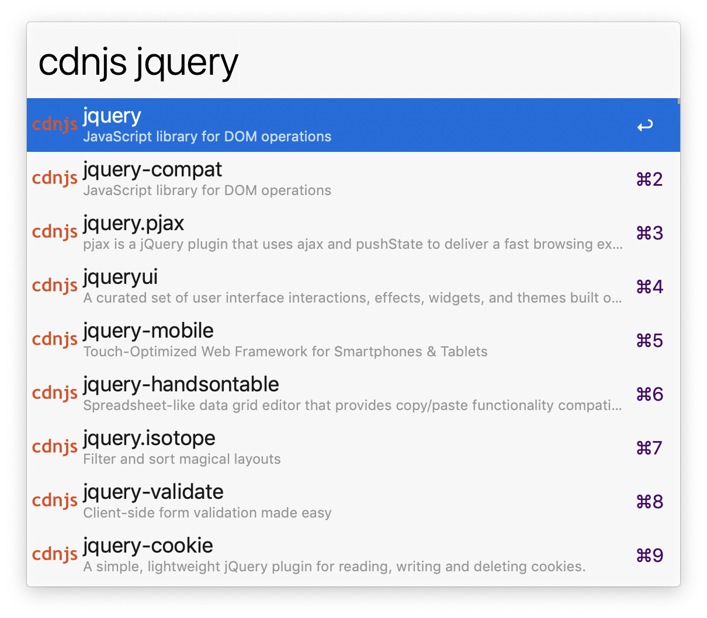

# alfred-cdnjs

## Install
See the [releases](https://github.com/reinvdwoerd/alfred-cdnjs/releases) section

## Usage
In Alfred, type `cdnjs`, <kbd>Enter</kbd>, and your query, to search for libraries.

Select a package and press <kbd>Enter</kbd> to copy a html script snippet with the library to clipboard. 

